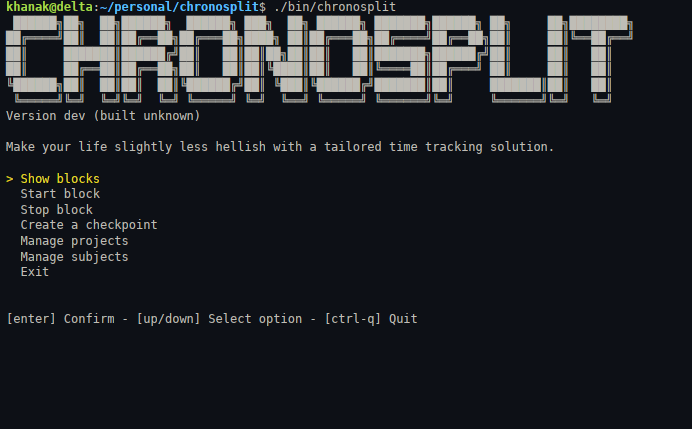

```
 ██████╗██╗  ██╗██████╗  ██████╗ ███╗  ██╗ ██████╗ ███████╗██████╗ ██╗     ██╗████████╗
██╔════╝██║  ██║██╔══██╗██╔═══██╗████╗ ██║██╔═══██╗██╔════╝██╔══██╗██║     ██║╚══██╔══╝
██║     ███████║██████╔╝██║   ██║██║██╗██║██║   ██║███████╗██████╔╝██║     ██║   ██║
██║     ██╔══██║██╔══██╗██║   ██║██║╚████║██║   ██║╚════██║██╔═══╝ ██║     ██║   ██║
╚██████╗██║  ██║██║  ██║╚██████╔╝██║ ╚███║╚██████╔╝███████║██║     ███████║██║   ██║
 ╚═════╝╚═╝  ╚═╝╚═╝  ╚═╝ ╚═════╝ ╚═╝  ╚══╝ ╚═════╝ ╚══════╝╚═╝     ╚══════╝╚═╝   ╚═╝
```

## About

Chronosplit is a TUI time tracking tool I built to my liking for personal use.





The core idea is working with a single active `block` of work at a time, which can be sliced into
chunks I call `checkpoints` within this project.

A `checkpoint` is categorized by `project`, `subject` and `description`, and these properties are required to be specified before a `checkpoint` can be created. This forces me to be specific and not have huge chunks of work time doing all kinds of things. Once finished, a work `block` can be stopped. Stopping a work `block` functions just like creating a `checkpoint`, but no further `checkpoints` can be made within this last `block`, and a new `block` must be started.

Data is persisted locally using a SQLite database, E.T. does not phone home.

## Features

- Simple terminal user interface built with [Bubble Tea](https://github.com/charmbracelet/bubbletea).
- Hand-crafted logo.
- Extremely elegant keyboard controls, according to me.
- Prevents messy, overlapping blocks of time.
- Data is stored locally, it literally is yours to keep.
- It is a time tracker, it can be used for things other than work! I just made it with work in mind, go wild.
- (TODO) Display time spent per project, subject, with descriptions of work done.

## Rules

- Only one work block can be active at a time.
- Active work block must exist for the stop feature to function.
- Checkpoint cannot be created without an active work block.
- Stopping a work block creates a final checkpoint within that block before it is concluded.

## Sample workflow

1. Create projects
2. Create subjects
3. Start a work block
4. Create a checkpoint
5. Stop work block

## Dependencies

The project was built using the following libraries:

- [Bubble Tea](https://github.com/charmbracelet/bubbletea): Used for menu construction and navigation.
- [Bubbles](https://github.com/charmbracelet/bubbles): Used for the framework compatible text input component to handle user input.
- [Lip Gloss](https://github.com/charmbracelet/lipgloss): Used for styling of success and error messages, tabular outputs and highlighting of currently selected menu item.
- [`modernc.org/sqlite`](https://gitlab.com/cznic/sqlite): Pure Go SQLite driver.

## Notes ~~or a TODO list in disguise, the jury is still out~~

- I am relatively new to Go, so I'm sure Go-heads will find many things wrong with this project, if they ever find it in the sea of pet projects.
- I definitely want to shift some of the business logic from menus to services.
- ~~I will add a separate logic to render navigation hints.~~ I DID IT!
- Yes, I will add godocs when I find the time to do it, I'm sure it will happen soon.
- This project used local AI ***gasp*** to copy `project` handling and make it into `subject` handling.
- Liking the bubbletea project, very cool!

## License

[MIT](https://github.com/khgreav/chronosplit/blob/main/LICENSE)
